# 评奖评优服务部 | 拉起“酱酱”的圆手，一起守望优秀！

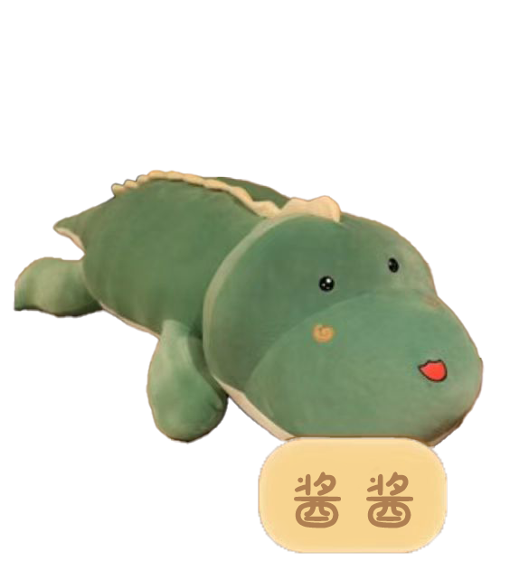{ align=left width="100"}

那你偏要去<b>“评奖”</b>什么意思

<b>“评奖”</b>到底有谁在啊

----

----

夏日炎炎正好眠，秋风瑟瑟正思君。

亲爱的ZJUers

“酱酱”向你挥了挥手，想要告诉你：

<h3><b>评奖评优服务部</b>纳新啦!!!</h3>

---

-----

评奖是什么

 &emsp;&emsp;浙江大学学生资助服务社评奖评优服务部，简称“评奖”，
主要负责国家奖学金、浙江省奖学金、校设奖学金及外设奖学金等信息表的收集与整理，
帮助建立学生、学院（园）与设奖单位间的有机联系，
在浙江大学本科学生评奖评优工作中起到桥梁作用。 
&emsp;&emsp;无论是校设奖学金、政府奖学金、各外设奖学金的评定，
还是优秀毕业生、优秀学生干部、先进班级等荣誉称号的评定，
评奖评优服务部都是整个环节中必不可少的一环。

---

---

评奖有：

一群认真负责温柔善良的主管层和老成员

一个温馨和睦幸福美满的酱酱小窝

=== "1"

    <figure markdown="span">
      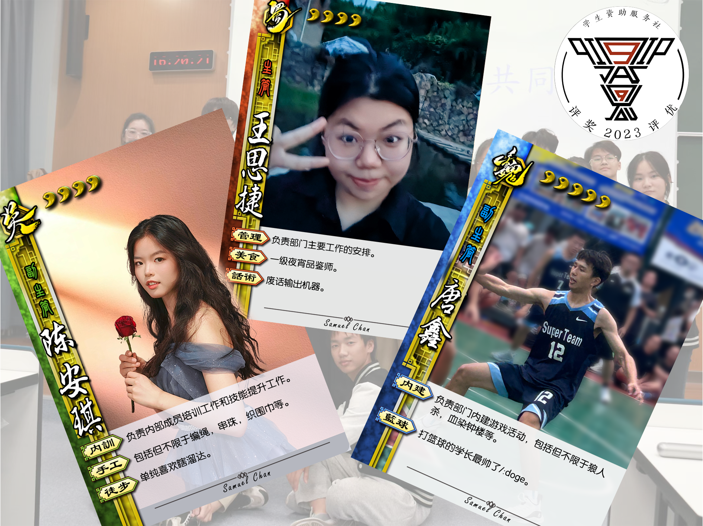
    </figure>

=== "2"

    <figure markdown="span">
      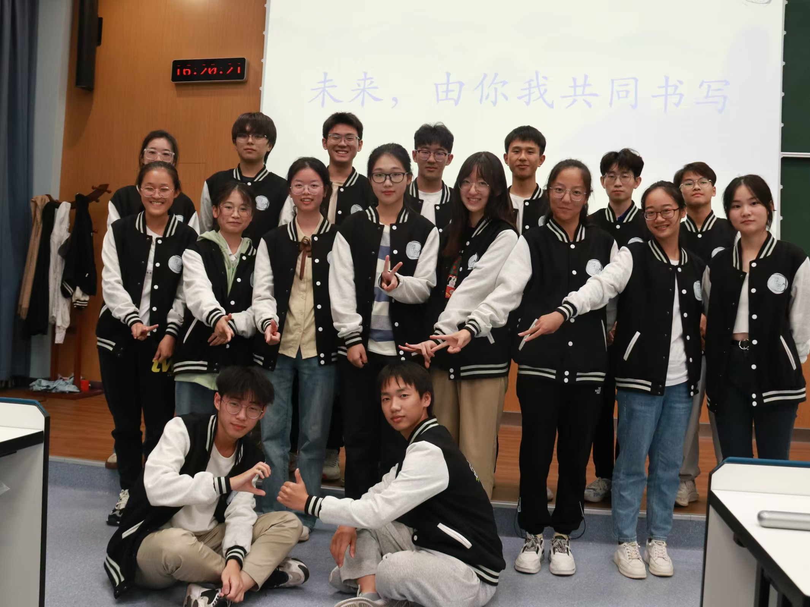
    </figure>

=== "3"

    <figure markdown="span">
      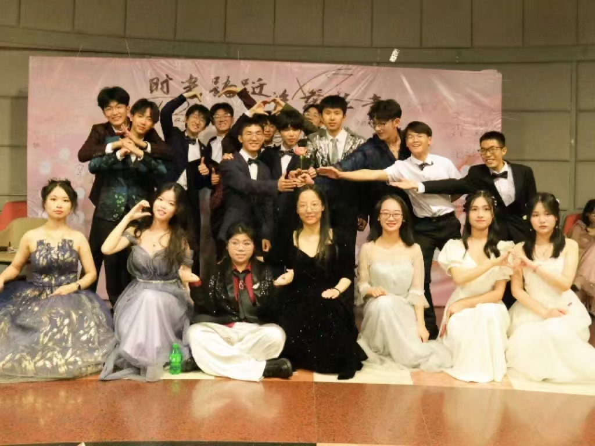
    </figure>

&emsp;&emsp;在这里，评奖评优服务部的每一位成员都秉持服务师生、
方便师生的态度，一丝不苟地审核表格、发放材料，保障评奖评优工作有序进行。 
&emsp;&emsp;接收一份份邮箱，整理一个个奖学金，云霞满纸令人昏昏想要入梦，梦中所见，无处不灿若星辰。

---

---

还有：

条分缕析的工作手册

=== "1"
    
    <figure markdown="span">
    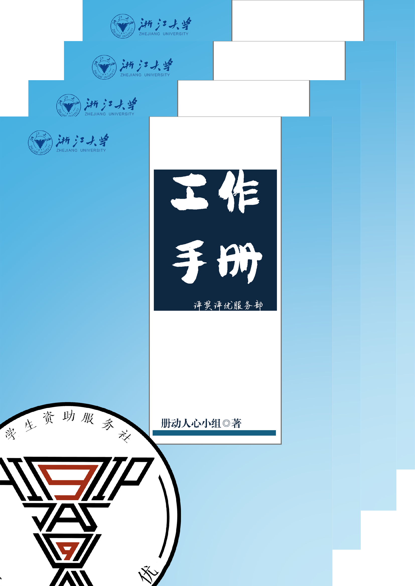{ width=80% }
    </fugure>

=== "2"

    <figure markdown="span">
    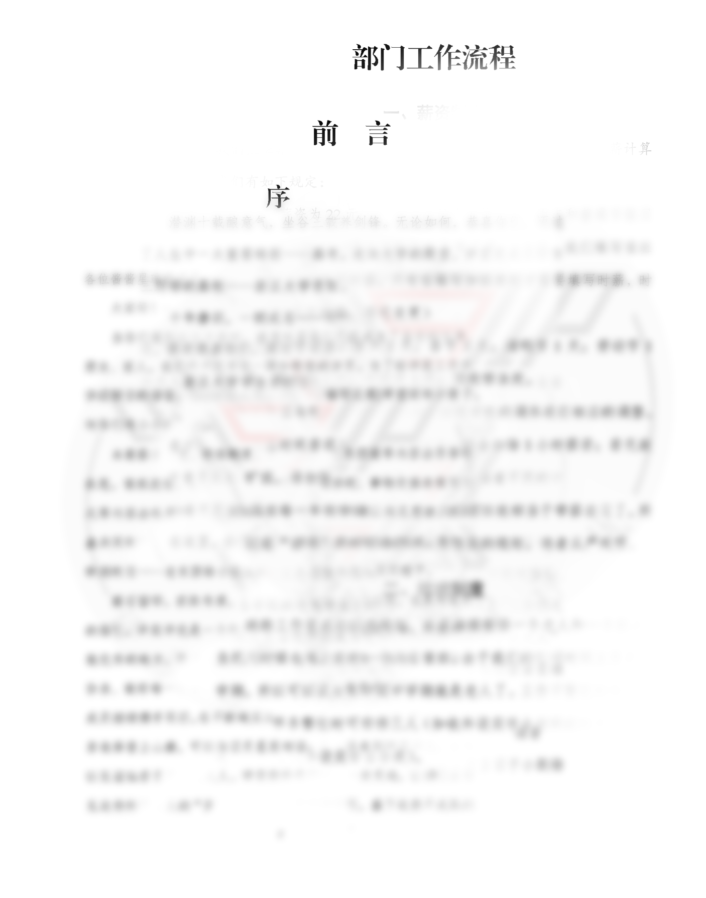{ width=80% }
    </fugure>
    
=== "3"
    
    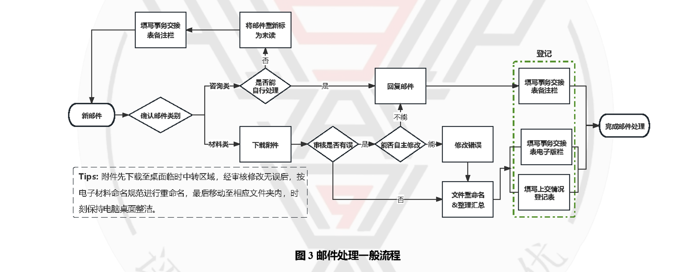{ width=80% }
    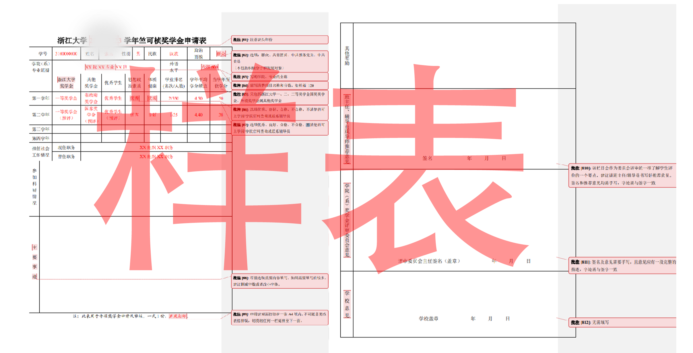{ width=80% }

&emsp;&emsp;踏石留印，抓铁有痕，
这本手册既是对来路的总结，也是对前路的指引。
评奖评优是一个特别的部门，是用生命温暖生命，用优秀成就优秀的地方，
既为评奖人，应秉评奖魂。
值好每一班岗、审好每一份表、做好每一件事，是评奖人的精神底色。

我们的slogan是

守望优秀，然后成为优秀！

---

---

<h3>选择评奖的n个理由</h3>

<h4>同舟共济扬帆起 乘风破浪万里航</h4>
<h4>酱酱小窝 是一个办公、学习与娱乐的集合体 是所有评奖人的温暖港湾</h4>
<h4>每次审核奖状和发放材料 都是对“酱酱”们工作能力的锻炼。</h4>
<h4>若选择登上山巅， 可以与日月星辰对话； 
若选择来到评奖， 亦可以见证灿若星辰的浙大人</h4>

=== "过生日"

    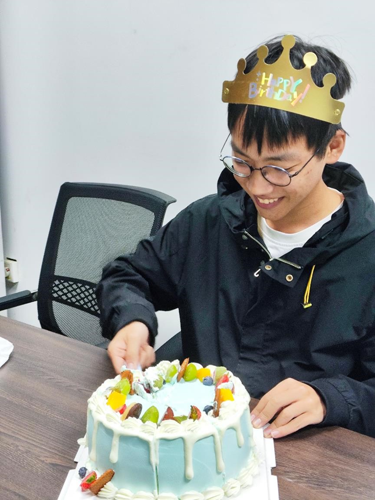{ width=49% }
    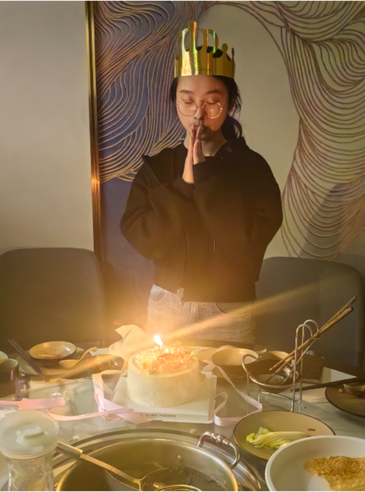{ width=49% }
    
    

    
    <figcaption>你的生日，酱酱给你过！</figcaption>
    
    

=== "看日出"

    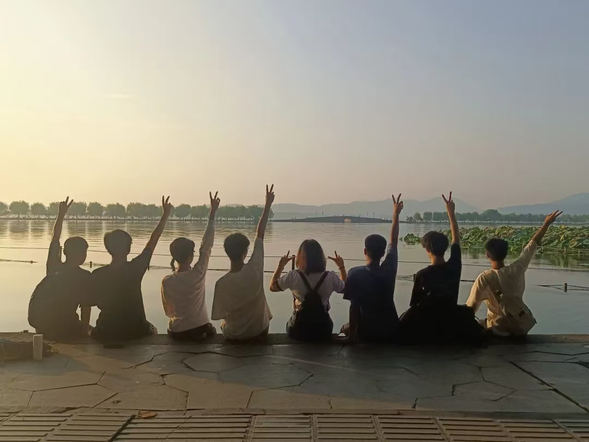{ width=49% }
    { width=49% }
    
    

    
    <figcaption>不会有人还没看过日出吧？</figcaption>
    
    

=== "集体生日"

    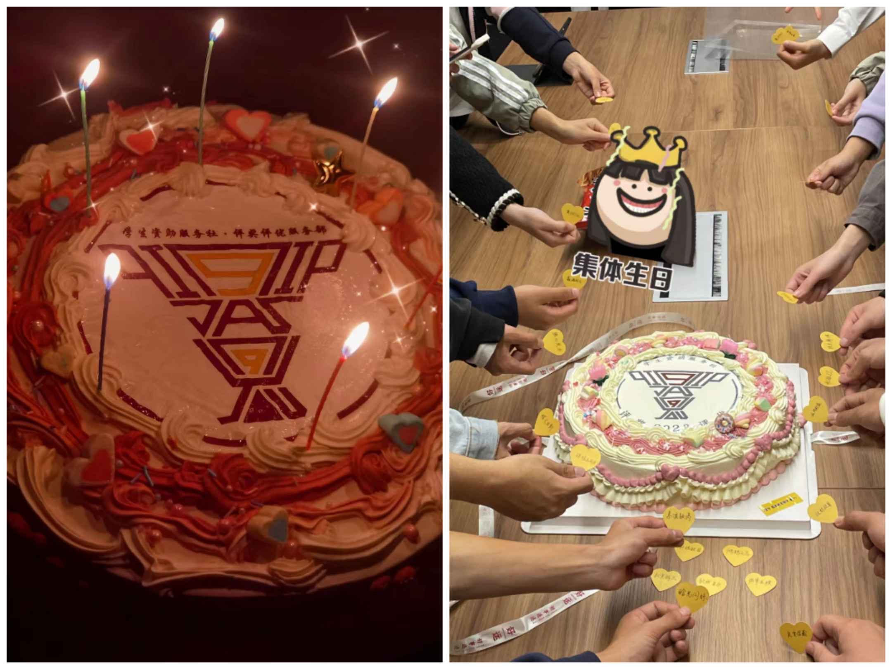
    
    

    
    <figcaption>集体生日，同庆共欢！</figcaption>
    
    

=== "轰趴、聚餐"

    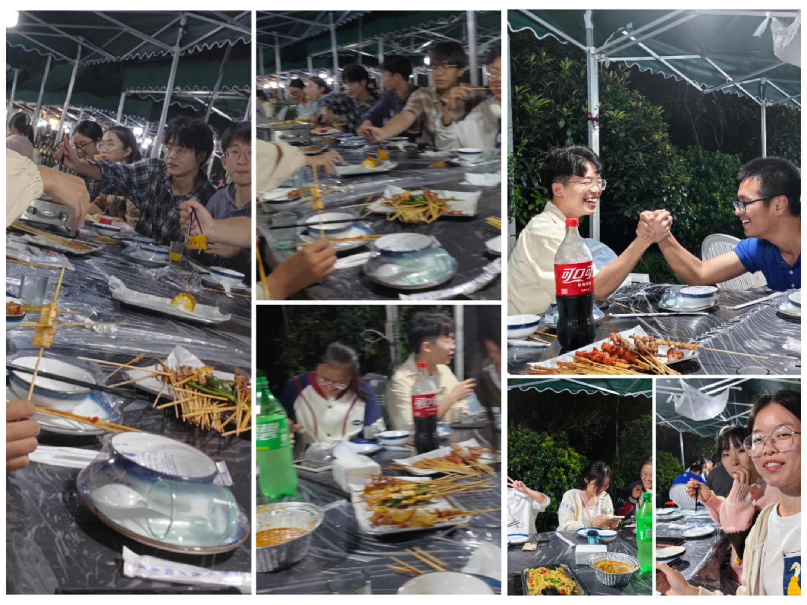
    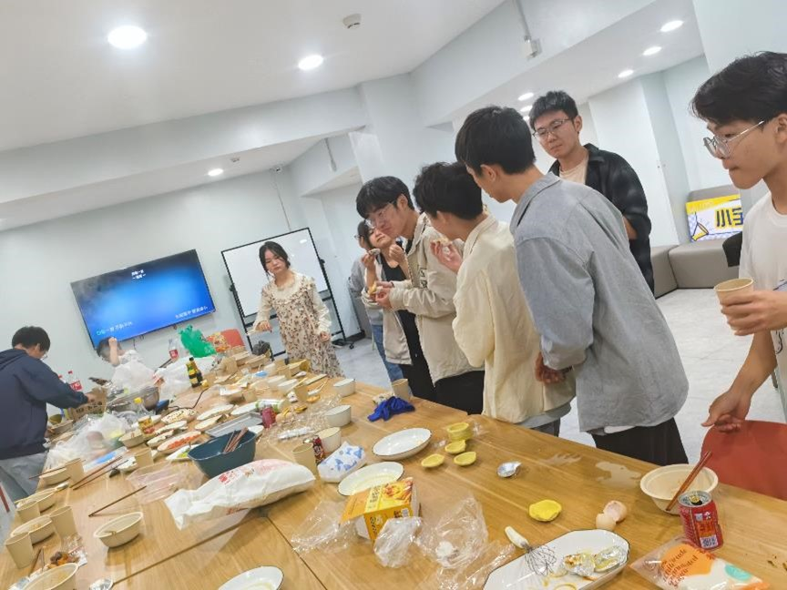{ width=49% }
    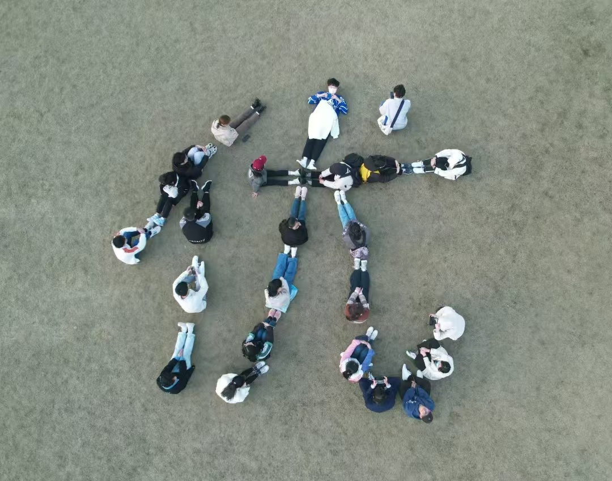{ width=49% }
    
    

    
    <figcaption>团建聚餐，说走就走！</figcaption>
    
    

在内训上，生存技能++

Excel、科学上网、杭城觅食、日常礼仪、魔方数独、方言学习……

应有尽有，更多技能等你来分享！

在内建上，快乐翻倍

狼人杀、剧本杀、uno、听歌识曲、你画我猜、海龟汤、部门联谊……

丰富多彩的团建活动等你共同策划！

在这里，你将收获满满干货和无限欢乐！ 在这里，“酱酱”们永远陪你！

---

---

山无陵，江水为竭 冬雷震震，夏雨雪 天地合，乃敢与君绝

在这爱意弥漫的季节里 诚挚邀请您拉起“酱酱”的圆手 一同漫步在星光之下
 让我们的心随夜风轻轻摇曳 共享这份宁静与浪漫

我们在 <b>评奖评优服务部</b> 等你一起 守望优秀，成为优秀！

